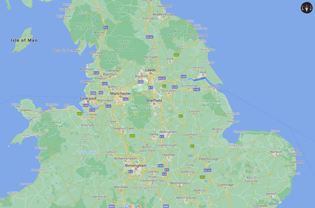

<head>

  </head>

# Barney Wakefield

## Projects

[Who Destroyed the An-225?](https://storymaps.arcgis.com/stories/b1dfc18d41d74e58af6beccb1f16fc18)

 
<body>
    

        
    

</body>

### H3
#### H4
##### H5
###### H6
